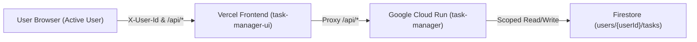

# Task Manager

A minimal, high-efficiency task management web application built with a decoupled architecture: a vanilla JavaScript frontend hosted on **Vercel** and a Node.js REST API service deployed on **Google Cloud Run** backed by **Google Cloud Firestore**.

---

## 🚀 Live Production Website

The application is deployed and available in production:

- **Production Web Application**: [https://task-manager-ui-gamma-blond.vercel.app](https://task-manager-ui-gamma-blond.vercel.app)
- **Production Backend API**: [https://task-manager-289332143182.us-central1.run.app](https://task-manager-289332143182.us-central1.run.app)
- **API Health Check**: [https://task-manager-ui-gamma-blond.vercel.app/api/health](https://task-manager-ui-gamma-blond.vercel.app/api/health)

---

## ✨ Features

- **👤 Per-User Data Isolation**: Tasks are created, stored, and retrieved strictly scoped to the active user (`userId`). Easily switch between users without data overlap.
- **⚡ Priority-Based Task Sorting**: Tasks are automatically ordered by priority:
  1. `High` (highest priority)
  2. `Medium`
  3. `Low` (lowest priority)
  Ties are ordered by creation timestamp descending.
- **🔄 In-Place Priority Modification**: Switch any task's priority level instantaneously directly from the task list.
- **📝 Task Details & Ongoing Notes**: Add detailed instructions or context during task creation and edit details in-place at any time to track ongoing progress.
- **✅ Mark as Done**: Mark tasks as completed or pending with a single click.
- **👁️ Hide / Show Completed Tasks**: Completed tasks are hidden by default to keep focus on pending work, with a toggle to view and restore completed items.
- **☁️ Persistent Cloud Storage**: All task data is persisted reliably per user in **Google Cloud Firestore** (Native mode).
- **📱 Responsive & Accessible UI**: Clean, mobile-friendly interface built with semantic HTML and CSS custom properties with zero external frontend build dependencies.

---

## 🏗️ Architecture



- **Frontend**: Vanilla HTML5, modern CSS3, and ES6 JavaScript hosted on Vercel.
- **API Proxy**: `vercel.json` rewrites `/api/*` requests directly to the Cloud Run backend, eliminating CORS issues in production.
- **Backend**: Express.js server on Google Cloud Run (`ai-learning-499409`).
- **Database**: Google Cloud Firestore with local JSON storage fallback for offline development and testing.

---

## 🛠️ Local Development

### Prerequisites

- Node.js 20+
- npm 10+

### Setup

1. **Clone the repository**:
   ```bash
   git clone https://github.com/noam2030/task-manager.git
   cd task-manager
   ```

2. **Install dependencies**:
   ```bash
   npm install
   ```

3. **Start the server locally**:
   ```bash
   npm start
   ```
   The local application will run at [http://localhost:8080](http://localhost:8080).

4. **Run tests**:
   ```bash
   npm test
   ```
   Runs the full suite of unit and integration tests using Node's built-in test runner.

---

## 📡 API Reference

All endpoints accept user identification via the `X-User-Id` request header or `?userId=<userId>` query parameter.

| Method | Endpoint | Description |
|---|---|---|
| `GET` | `/api/tasks` | Retrieve all tasks for the current user, sorted by priority |
| `POST` | `/api/tasks` | Create a new task (`{ "title": "...", "priority": "High", "details": "..." }`) |
| `PATCH` | `/api/tasks/:id` | Update task (`completed`, `priority`, `title`, or `details`) |
| `DELETE` | `/api/tasks/:id` | Delete a task by ID |
| `GET` | `/api/health` | Health check probe (`{ "status": "ok" }`) |

---

## 📄 Specification

For complete technical specifications, architectural decisions, and requirement history, refer to [SPEC.md](SPEC.md).
