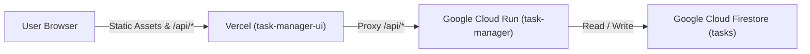

# Project Specification

## 1. Overview
Task Manager is a minimal, high-efficiency web application designed to manage personal tasks. Users can create tasks, assign them an initial priority level (High, Medium, Low), edit or update the priority of any existing task at any time, toggle completion status, and remove tasks. The application automatically displays all tasks sorted according to their priority level, ensuring high-priority items are addressed first. The architecture is decoupled: the frontend UI is deployed to **Vercel** under the project **`task-manager-ui`**, while the backend REST API runs on **Google Cloud Run** in project `task-manager-510913` with persistent storage in **Google Cloud Firestore**.

## 2. Requirements
- **Task Creation**: Users can create tasks with a title and an assigned priority (`High`, `Medium`, or `Low`).
- **Priority Modification**: Users can change the priority level (`High`, `Medium`, or `Low`) of any existing task directly from the task list.
- **Priority-Based Sorting**: The task list must always be ordered primarily by priority level:
  1. `High` (highest priority)
  2. `Medium`
  3. `Low` (lowest priority)
  Ties are ordered by creation timestamp in descending order (most recently created first). When a task's priority is modified, the list automatically updates to reflect the new sorting order.
- **Task Status Toggle**: Users can mark tasks as completed or incomplete.
- **Task Deletion**: Users can remove existing tasks.
- **Decoupled Frontend Deployment**: The UI part of the application is deployed to Vercel as project `task-manager-ui`.
- **Backend Cloud Deployment & Persistence**: The backend API is deployed to Google Cloud Run (`task-manager-510913`) and persists task data in Google Cloud Firestore (Native mode).
- **Vercel-to-GCP Integration**: Vercel transparently proxies `/api/*` traffic to the Google Cloud Run service, avoiding cross-origin complexities.
- **Minimal Codebase**: The solution uses minimal, readable, dependency-light code without unnecessary boilerplate or heavy frameworks.
- **Automated Testing**: Comprehensive unit and API tests verifying task sorting, creation, priority editing, updating, deletion, and storage abstraction.
- **CI/CD Pipeline**: GitHub Actions workflows for automated testing and deployments.

## 3. User Experience
- **Header & Overview**: Clean header displaying the application title and a task count summary.
- **Input Form**: Single-line form with an input for task title, a priority select dropdown (`High`, `Medium`, `Low`), and an "Add Task" button.
- **Task List View**:
  - Displays tasks sorted by priority (`High` -> `Medium` -> `Low`).
  - Interactive priority selector badge on each task item allowing instantaneous switching between `High`, `Medium`, and `Low` with corresponding badge styling:
    - `High`: Red / Coral badge
    - `Medium`: Amber / Orange badge
    - `Low`: Green / Teal badge
  - Immediate re-sorting of the task list upon priority change so reprioritized tasks shift to their correct sorted position.
  - Interactive checkbox to toggle completion status with strikethrough styling for completed tasks.
  - Delete button (`✕`) with immediate optimistic/real-time update.
  - Empty state displaying an encouraging message when no tasks are present.
- **Responsive Design**: Fast, modern, mobile-friendly interface designed with accessible semantic HTML and CSS variables.

## 4. Architecture
The application employs a decoupled modern web architecture:
- **Frontend (Vercel)**: Static HTML5, modern CSS3, and vanilla JavaScript hosted globally on Vercel (`task-manager-ui`).
- **Reverse Proxy / Rewrites**: `vercel.json` rewrites `/api/*` requests to the Google Cloud Run backend.
- **Backend (Google Cloud Run)**: Lightweight Node.js Express server providing RESTful JSON APIs with CORS support.
- **Persistent Storage**: Google Cloud Firestore (Native mode) collection `tasks` in `task-manager-510913`.
- **Local/Test Environment**: In-memory / file-backed JSON store (`data/tasks.json`) for local development and offline automated testing.



## 5. Technology Stack
- **Language & Runtime**: Node.js 20+ (ES Modules)
- **Web Framework**: Express 4.x (minimal web & API framework)
- **Database & Persistence**: Google Cloud Firestore (`@google-cloud/firestore`) with local fallback
- **Frontend**: Vanilla HTML5, CSS3, ES6 JavaScript (zero build step)
- **Frontend Hosting**: Vercel (Project: `task-manager-ui`)
- **Backend Hosting**: Google Cloud Run (Project: `task-manager-510913`)
- **Test Framework**: Node.js native test runner (`node:test`) and assertion library (`node:assert`)
- **Containerization**: Docker (Node Alpine base image)
- **CI/CD & Version Control**: Git, GitHub repository (`task-manager`), and GitHub Actions

## 6. Backend
- **File Structure**:
  - `server.js`: Server bootstrap, CORS handling, Express configuration, middleware, and route mounting.
  - `src/taskStore.js`: Task repository abstraction with Firestore integration, local fallback, priority sorting logic, and CRUD operations.
  - `src/routes.js`: Express router handling HTTP endpoints with validation and error responses.
- **CORS Handling**: Supports CORS headers allowing requests from Vercel deployments and local development origins.
- **Priority Ranking Algorithm**:
  - Priority weights: `High` = 1, `Medium` = 2, `Low` = 3.
  - Sorting comparator: Compare priority weight ascending; if weights are equal, sort `createdAt` descending.
- **Persistence & Cloud Run Activation**:
  - Firestore activation triggers when `USE_FIRESTORE === 'true'`, OR when running inside Google Cloud Run (`Boolean(process.env.K_SERVICE)`), unless explicitly disabled with `options.useFirestore === false` (used by unit tests).
  - Default Firestore project ID is `task-manager-510913` (overridable via `GOOGLE_CLOUD_PROJECT`).
  - Startup logs identify storage driver (`[TaskStore] Using Firestore (project: ...)` vs `[TaskStore] Using local file/memory store`).

## 7. Frontend
- **File Structure**:
  - `public/index.html`: Accessible semantic markup with task form, priority selector, and task list container.
  - `public/style.css`: Modern, clean CSS using CSS custom properties (variables), Flexbox, responsive layout.
  - `public/app.js`: Client-side logic handling form submission, priority changing, calling `/api/tasks`, rendering cards, and handling updates/deletions.
  - `vercel.json`: Vercel project configuration linking `public/` directory and proxying `/api/*` to Cloud Run.
- **State Handling**: Fetches task list from `/api/tasks` on page load, and after any mutation (create, complete, priority change, delete) re-renders the sorted list.

## 8. Data Model
### Task Entity Schema
| Field | Type | Description |
|---|---|---|
| `id` | `string` | Unique identifier (UUID v4) |
| `title` | `string` | Task title / description (non-empty, trimmed) |
| `priority` | `string` | Enum: `'High' \| 'Medium' \| 'Low'` |
| `completed` | `boolean` | Status flag (`false` by default) |
| `createdAt` | `string` | ISO 8601 timestamp string |
| `updatedAt` | `string` | ISO 8601 timestamp string |

## 9. API
All endpoints return JSON responses.

### Endpoints
1. `GET /api/tasks`
   - Description: Retrieves all tasks sorted by priority (`High` -> `Medium` -> `Low`), then by newest `createdAt`.
   - Response `200 OK`: `[{ "id": "...", "title": "...", "priority": "High", "completed": false, ... }]`
2. `POST /api/tasks`
   - Description: Creates a new task.
   - Request Body:
     ```json
     {
       "title": "Fix login bug",
       "priority": "High"
     }
     ```
   - Response `201 Created`: Created task object.
   - Response `400 Bad Request`: Validation error if `title` is missing/empty or `priority` is not in `['High', 'Medium', 'Low']`.
3. `PATCH /api/tasks/:id`
   - Description: Updates a task's `completed` status or `priority` (`High`, `Medium`, `Low`) or `title`.
   - Request Body:
     ```json
     {
       "priority": "High"
     }
     ```
   - Response `200 OK`: Updated task object.
   - Response `400 Bad Request`: Validation error if `priority` is not valid.
   - Response `404 Not Found`: If task ID does not exist.
4. `DELETE /api/tasks/:id`
   - Description: Deletes a task by ID.
   - Response `204 No Content`
   - Response `404 Not Found`: If task ID does not exist.
5. `GET /api/health`
   - Description: Liveness and readiness probe for Cloud Run.
   - Response `200 OK`: `{"status": "ok"}`

## 10. Configuration
- **Port**: `PORT` environment variable (defaults to `8080`).
- **Node Environment**: `NODE_ENV` (defaults to `production` in container, `development` locally).
- **Data File**: `DATA_FILE_PATH` (defaults to `./data/tasks.json` for local fallback).
- **GCP Project**: `task-manager-510913` (defaults in code and set via `GOOGLE_CLOUD_PROJECT`).
- **Backend API URL**: `https://task-manager-608477010863.us-central1.run.app` (routed in `vercel.json`).
- **Vercel Project Name**: `task-manager-ui`.
- **GCP Region**: `us-central1`.

## 11. Testing
- **Test Framework**: Node.js built-in `node:test` and `node:assert/strict`.
- **Unit & Integration Test Suite** (`test/taskStore.test.js`, `test/api.test.js`):
  - Verification of priority ordering: `High` appears before `Medium`, `Medium` appears before `Low`.
  - Verification of priority modification: changing a task's priority (e.g., `Low` to `High`) moves it to the correct sorted position.
  - Secondary sorting: equal priority sorted newest first.
  - Creation, completion toggle, and deletion flows.
  - Validation: reject invalid priority values or blank titles.
  - Health check endpoint verification.
  - CORS header verification for cross-domain requests.
  - Tests run offline with zero external database dependencies.
- **Execution**: `npm test` runs all tests cleanly with zero third-party testing dependencies.

## 12. Deployment
- **Frontend Deployment (Vercel)**:
  - Project: `task-manager-ui`
  - Output / Static Directory: `public`
  - Config: `vercel.json` with API proxy rewrites to Cloud Run backend.
- **Backend Deployment (Google Cloud Run)**:
  - Project ID: `task-manager-510913`
  - Cloud Firestore: Default database in `us-central1`.
  - Production Service: `task-manager` on Cloud Run.
  - Staging Service: `task-manager-staging` on Cloud Run.
- **GitHub Actions Workflows**:
  - `.github/workflows/ci.yml`: Runs `npm test` on all pull requests and commits to `main`.
  - `.github/workflows/deploy-staging.yml`: Deploys to `task-manager-staging` on PR.
  - `.github/workflows/deploy-prod.yml`: Deploys to `task-manager` on merge to `main`.
