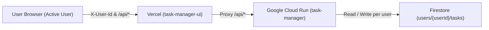

# Project Specification

## 1. Overview
Task Manager is a minimal, high-efficiency web application designed to manage personal tasks on a per-user basis. Each user has their own isolated workspace where tasks are created, stored, and managed independently. Users can create tasks, assign them an initial priority level (High, Medium, Low), add optional detailed context or instructions (`details`), edit or update task priority and details at any time, mark tasks as done (completed), and toggle the visibility of completed tasks with the default set to **hidden**. The application automatically displays each user's tasks sorted according to their priority level, ensuring high-priority items are addressed first. The architecture is decoupled: the frontend UI is deployed to **Vercel** under the project **`task-manager-ui`**, while the backend REST API runs on **Google Cloud Run** in project `ai-learning-499409` with persistent, user-scoped storage in **Google Cloud Firestore**.

## 2. Requirements
- **Per-User Isolation**: All task creation, storage, retrieval, modification, and deletion are strictly scoped to the active user (`userId`). User A cannot access or modify User B's tasks.
- **User Identity & Switching**: Users identify themselves by a username or identifier. The frontend allows switching users, persisting the active user in local storage.
- **Task Creation**: Users can create tasks with a title, an optional details/notes field, and an assigned priority (`High`, `Medium`, or `Low`) within their account.
- **Task Details (Creation, Full-Screen Viewing & Editing)**: Users can attach detailed context/notes during task creation. To keep the task list clean and compact, details are hidden from the main list items; instead, each task has a dedicated "Details" button. Clicking this button opens a full-screen view displaying the details, equipped with an "Edit Details" button allowing multi-line editing with Save/Cancel controls.
- **Top Bar Links (GitHub & Backend API)**:
  - The top bar provides direct links to the project's GitHub repository and the backend REST API.
  - The GitHub link directs to `https://github.com/noam2030/task-manager` and opens in a new tab.
  - The Backend API link dynamically points to the active environment's `/api/tasks` endpoint and opens in a new tab.
- **Environment-Aware API Resolution (Staging vs Production)**:
  - Staging Vercel deployments (preview domains on `*.vercel.app` or hostnames containing `staging`) strictly use the Staging Cloud Run backend: `https://task-manager-staging-289332143182.us-central1.run.app`.
  - Production Vercel deployments (`https://task-manager-ui-gamma-blond.vercel.app`) strictly use the Production Cloud Run backend: `https://task-manager-289332143182.us-central1.run.app`.
  - Local development environments (`localhost`, `127.0.0.1`) route to the local origin (`http://localhost:8080`).
- **Priority Modification**: Users can change the priority level (`High`, `Medium`, or `Low`) of any existing task directly from their task list.
- **Priority-Based Sorting**: The user's task list must always be ordered primarily by priority level:
  1. `High` (highest priority)
  2. `Medium`
  3. `Low` (lowest priority)
  Ties are ordered by creation timestamp in descending order (most recently created first). When a task's priority is modified, the list automatically updates to reflect the new sorting order.
- **Task Completion (Mark as Done)**: Users can mark tasks as completed (done) or incomplete (pending).
- **Hide / Show Done Tasks Toggle**:
  - The application provides a user-facing control to toggle between hiding and showing completed tasks.
  - The default state is **hide done tasks** (`showCompleted = false`).
  - When hidden (default), completed tasks are excluded from the main task list view.
  - When shown, completed tasks are displayed in the list with completed styling (strikethrough text and checked state).
  - The toggle indicates how many completed tasks exist (e.g. "Show done (3)").
- **Task Deletion**: Users can remove existing tasks belonging to their account.
- **Decoupled Frontend Deployment**: The UI part of the application is deployed to Vercel as project `task-manager-ui`.
- **Backend Cloud Deployment & Persistence**: The backend API is deployed to Google Cloud Run (`ai-learning-499409`) and persists task data per-user in Google Cloud Firestore (Native mode).
- **Vercel-to-GCP Integration**: Vercel transparently proxies `/api/*` traffic to the Google Cloud Run service, avoiding cross-origin complexities.
- **Minimal Codebase**: The solution uses minimal, readable, dependency-light code without unnecessary boilerplate or heavy frameworks.
- **Automated Testing**: Comprehensive unit and API tests verifying user data isolation, task sorting, creation, priority editing, completion toggling, deletion, and storage abstraction.
- **CI/CD Pipeline**: GitHub Actions workflows for automated testing and deployments.
- **Project Documentation**: Top-level `README.md` providing project overview, feature summary, quick start guide, and direct links to the production website.

## 3. User Experience
- **Header & Top Bar**: Clean header displaying the application title, subtitle, top-bar links to GitHub and the environment-specific Backend API, the active user badge (e.g. `👤 noam`), a `"Switch User"` button, and a task count summary (total, pending, completed).
- **User Selection / Switch Modal**: Intuitive prompt to enter or change the active username.
- **Input Form**: Single-line form with an input for task title, an optional details/notes field for extended context, a priority select dropdown (`High`, `Medium`, `Low`), and an "Add Task" button.
- **Filter Controls**:
  - A toggle button in the list header labeled `"Show done (N)"` / `"Hide done"` to switch visibility of completed tasks.
  - Default view hides completed tasks so users can focus on pending work.
- **Task List View**:
  - Displays user's visible tasks sorted by priority (`High` -> `Medium` -> `Low`).
  - Compact and clean task items: details text is not displayed in the main list. Each item includes the checkbox, task title, a `"Details"` button, the priority select dropdown, and the delete button.
  - Interactive priority selector badge on each task item allowing instantaneous switching between `High`, `Medium`, and `Low` with corresponding badge styling:
    - `High`: Red / Coral badge
    - `Medium`: Amber / Orange badge
    - `Low`: Green / Teal badge
  - Interactive checkbox / done button to mark task as completed (done). When marked as done, if completed tasks are hidden, the task is smoothly removed from the active view.
  - Completed tasks when visible display with strikethrough title and subdued text color.
  - Delete button (`✕`) with immediate optimistic/real-time update.
  - Empty state displaying a friendly message when no pending tasks remain or no tasks exist for the active user.
- **Full-Screen Task Details Modal / View**:
  - Clicking the `"Details"` button on any task opens a full-screen view displaying task title, priority badge, completion status, and the complete formatted details text (`white-space: pre-wrap`).
  - Displays an `"Edit Details"` button to switch to inline editing within the full-screen view.
  - Edit mode features a spacious textarea and `"Save"` / `"Cancel"` buttons.
  - When saving, updates the task via `PATCH /api/tasks/:id` with instant visual feedback ("Saving...").
  - Features a prominent `"Close"` button (also supports pressing `Escape` or clicking the backdrop) to return seamlessly to the task list.
- **Responsive Design**: Fast, modern, mobile-friendly interface designed with accessible semantic HTML and CSS variables.

## 4. Architecture
The application employs a decoupled modern web architecture with per-user data partitioning:
- **Frontend (Vercel)**: Static HTML5, modern CSS3, and vanilla JavaScript hosted globally on Vercel (`task-manager-ui`), attaching `X-User-Id` to all API requests.
- **Reverse Proxy / Rewrites**: `vercel.json` rewrites `/api/*` requests to the Google Cloud Run backend.
- **Backend (Google Cloud Run)**: Lightweight Node.js Express server providing RESTful JSON APIs with user extraction and CORS support.
- **Persistent Storage**: Google Cloud Firestore (Native mode) with tasks stored under `users/{userId}/tasks` (or scoped by `userId`) in `ai-learning-499409`.
- **Local/Test Environment**: In-memory / file-backed JSON store partitioned by `userId` for local development and offline automated testing.



## 5. Technology Stack
- **Language & Runtime**: Node.js 20+ (ES Modules)
- **Web Framework**: Express 4.x (minimal web & API framework)
- **Database & Persistence**: Google Cloud Firestore (`@google-cloud/firestore`) with per-user collections and local fallback
- **Frontend**: Vanilla HTML5, CSS3, ES6 JavaScript (zero build step)
- **Frontend Hosting**: Vercel (Project: `task-manager-ui`)
- **Backend Hosting**: Google Cloud Run (Project: `ai-learning-499409`)
- **Test Framework**: Node.js native test runner (`node:test`) and assertion library (`node:assert`)
- **Containerization**: Docker (Node Alpine base image)
- **CI/CD & Version Control**: Git, GitHub repository (`task-manager`), and GitHub Actions

## 6. Backend
- **File Structure**:
  - `server.js`: Server bootstrap, CORS handling, Express configuration, middleware, and route mounting.
  - `src/taskStore.js`: Task repository abstraction with per-user data handling, Firestore integration (`users/{userId}/tasks`), local fallback, priority sorting logic, and CRUD operations.
  - `src/routes.js`: Express router extracting `userId` from `X-User-Id` header (or `userId` query parameter fallback), validating user presence, and dispatching to store.
- **User Scoping & Security**:
  - Middleware extracts `userId = req.headers['x-user-id']?.trim() || req.query.userId?.trim()`.
  - If missing, defaults to `'default-user'`.
- **CORS & Cache Control Handling**:
  - Supports CORS headers allowing `X-User-Id` header across all origins.
  - Sends `Cache-Control: no-store, no-cache, must-revalidate, private`, `Pragma: no-cache`, and `Vary: X-User-Id` to prevent proxy/browser caching across user switches.
- **Priority Ranking Algorithm**:
  - Priority weights: `High` = 1, `Medium` = 2, `Low` = 3.
  - Sorting comparator: Compare priority weight ascending; if weights are equal, sort `createdAt` descending.

## 7. Frontend
- **File Structure**:
  - `public/index.html`: Accessible semantic markup with top bar external navigation links (GitHub and Backend API), user profile pill, task form, priority selector, show/hide done tasks toggle, and task list container.
  - `public/style.css`: Modern, clean CSS using CSS custom properties (variables), Flexbox, top bar link styles, user pill styling, responsive layout.
  - `public/app.js`: Client-side logic managing `currentUserId`, attaching both `X-User-Id` header and `?userId=<userId>` query parameter on all requests with `cache: 'no-store'`, handling user switching, task creation, priority changing, completion toggling, filtering, rendering cards, and handling deletions. Dynamically targets staging backend `https://task-manager-staging-289332143182.us-central1.run.app` when deployed on Vercel preview or staging domains, and targets production backend `https://task-manager-289332143182.us-central1.run.app` when deployed on production. Configures the top-bar Backend API link accordingly.
  - `vercel.json`: Vercel project configuration linking `public/` directory and proxying `/api/*` to the appropriate Cloud Run service.
- **State Handling**:
  - `currentUserId`: string stored in `localStorage` (defaults to `'noam'`).
  - `showCompleted`: boolean flag, defaults to `false` (hide done tasks).
  - Toggling user re-fetches and renders tasks for the newly selected user.

## 8. Data Model
### Task Entity Schema
| Field | Type | Description |
|---|---|---|
| `id` | `string` | Unique identifier (UUID v4) |
| `userId` | `string` | Identifier of the owning user |
| `title` | `string` | Task title / description (non-empty, trimmed) |
| `priority` | `string` | Enum: `'High' \| 'Medium' \| 'Low'` |
| `details` | `string` | Optional details, instructions, or ongoing progress context (string, defaults to `""`) |
| `completed` | `boolean` | Status flag (`false` by default) |
| `createdAt` | `string` | ISO 8601 timestamp string |
| `updatedAt` | `string` | ISO 8601 timestamp string |

## 9. API
All endpoints accept user identification via `X-User-Id` header or `?userId=<userId>` query parameter (defaulting to `'default-user'`). All responses return JSON and include `Cache-Control: no-store, no-cache, must-revalidate, private`.

### Endpoints
1. `GET /api/tasks`
   - Description: Retrieves all tasks for the requesting user, sorted by priority (`High` -> `Medium` -> `Low`), then by newest `createdAt`.
   - Headers: `X-User-Id: <userId>`
   - Query Parameters: `userId=<userId>` (optional fallback)
   - Response `200 OK`: `[{ "id": "...", "userId": "...", "title": "...", "priority": "High", "details": "...", "completed": false, ... }]`
2. `POST /api/tasks`
   - Description: Creates a new task for the requesting user.
   - Headers: `X-User-Id: <userId>`
   - Query Parameters: `userId=<userId>` (optional fallback)
   - Request Body:
     ```json
     {
       "title": "Fix login bug",
       "priority": "High",
       "details": "Investigate session expiration in Safari"
     }
     ```
   - Response `201 Created`: Created task object with `userId` and `details`.
   - Response `400 Bad Request`: Validation error if `title` is missing/empty or `priority` is invalid.
3. `PATCH /api/tasks/:id`
   - Description: Updates a task's `completed` status (`true` / `false`), `priority`, `title`, or `details` for the requesting user.
   - Headers: `X-User-Id: <userId>`
   - Query Parameters: `userId=<userId>` (optional fallback)
   - Request Body:
     ```json
     {
       "details": "Root cause confirmed in middleware token validation"
     }
     ```
   - Response `200 OK`: Updated task object.
   - Response `404 Not Found`: If task ID does not exist for the requesting user.
4. `DELETE /api/tasks/:id`
   - Description: Deletes a task by ID for the requesting user.
   - Headers: `X-User-Id: <userId>`
   - Query Parameters: `userId=<userId>` (optional fallback)
   - Response `204 No Content`
   - Response `404 Not Found`: If task ID does not exist for the requesting user.
5. `GET /api/health`
   - Description: Liveness and readiness probe for Cloud Run.
   - Response `200 OK`: `{"status": "ok"}`

## 10. Configuration
- **Port**: `PORT` environment variable (defaults to `8080`).
- **Node Environment**: `NODE_ENV` (defaults to `production` in container, `development` locally).
- **Data File**: `DATA_FILE_PATH` (defaults to `./data/tasks.json` for local fallback).
- **GCP Project**: `ai-learning-499409` (defaults in code and set via `GOOGLE_CLOUD_PROJECT`).
- **GitHub Repository**: `https://github.com/noam2030/task-manager`.
- **Production Frontend URL**: `https://task-manager-ui-gamma-blond.vercel.app`.
- **Production Backend URL**: `https://task-manager-289332143182.us-central1.run.app`.
- **Staging Backend URL**: `https://task-manager-staging-289332143182.us-central1.run.app`.
- **Vercel Project Name**: `task-manager-ui`.
- **GCP Region**: `us-central1`.

## 11. Testing
- **Test Framework**: Node.js built-in `node:test` and `node:assert/strict`.
- **Unit & Integration Test Suite** (`test/taskStore.test.js`, `test/api.test.js`):
  - Verification of user isolation: User A's tasks are not accessible or visible to User B.
  - Verification that User B cannot modify or delete User A's tasks.
  - Verification of priority ordering: `High` appears before `Medium`, `Medium` appears before `Low`.
  - Verification of priority modification and completion status toggles.
  - Verification of task details: creation with details, editing details via PATCH, and persistence.
  - Health check endpoint verification.
  - CORS header verification for cross-domain requests (including `X-User-Id` allowance).
  - Tests run offline with zero external database dependencies.
- **Execution**: `npm test` runs all tests cleanly with zero third-party testing dependencies.

## 12. Deployment
- **Frontend Deployment (Vercel)**:
  - Project: `task-manager-ui`
  - Output / Static Directory: `public`
  - Production URL: `https://task-manager-ui-gamma-blond.vercel.app`
  - Config: `vercel.json` with API proxy rewrites to Cloud Run backend.
- **Backend Deployment (Google Cloud Run)**:
  - Project ID: `ai-learning-499409`
  - Cloud Firestore: Default database in `us-central1`.
  - Production Service: `task-manager` on Cloud Run.
  - Staging Service: `task-manager-staging` on Cloud Run.
- **GitHub Actions Workflows**:
  - `.github/workflows/ci.yml`: Runs `npm test` on all pull requests and commits to `main`.
  - `.github/workflows/deploy-staging.yml`: Deploys to `task-manager-staging` on PR.
  - `.github/workflows/deploy-prod.yml`: Deploys to `task-manager` on merge to `main`.
