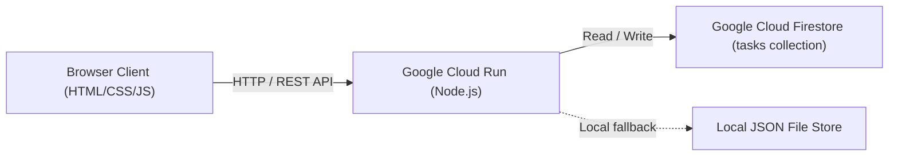

# Project Specification

## 1. Overview
Task Manager is a minimal, high-efficiency web application designed to manage personal tasks. Users can create tasks, assign them a priority level (High, Medium, Low), toggle their completion status, and remove tasks. The application automatically displays all tasks sorted according to their priority level, ensuring high-priority items are addressed first. All task data is persistently stored in Google Cloud Firestore when running in the cloud, guaranteeing data durability across container restarts and scaling. The service is containerized and deployed to Google Cloud Run in the `task-manager-510913` project.

## 2. Requirements
- **Task Creation**: Users can create tasks with a title and an assigned priority (`High`, `Medium`, or `Low`).
- **Priority-Based Sorting**: The task list must always be ordered primarily by priority level:
  1. `High` (highest priority)
  2. `Medium`
  3. `Low` (lowest priority)
  Ties are ordered by creation timestamp in descending order (most recently created first).
- **Task Status Toggle**: Users can mark tasks as completed or incomplete.
- **Task Deletion**: Users can remove existing tasks.
- **Data Persistence**: Data must persist across container restarts, instance scaling, and service redeployments using Google Cloud Firestore (Native mode), with local file/in-memory fallback for local development and test execution.
- **Minimal Codebase**: The solution uses minimal, readable, dependency-light code without unnecessary boilerplate or heavy frameworks.
- **Automated Testing**: Comprehensive unit and API tests verifying task sorting, creation, updating, deletion, and storage abstraction.
- **Cloud Deployment**: Containerized with Docker and deployable to Google Cloud Run under GCP project `task-manager-510913`.
- **CI/CD Pipeline**: GitHub Actions workflows for automated testing, staging deployment on PRs, and production deployment on merge to `main`.

## 3. User Experience
- **Header & Overview**: Clean header displaying the application title and a task count summary.
- **Input Form**: Single-line form with an input for task title, a priority select dropdown (`High`, `Medium`, `Low`), and an "Add Task" button.
- **Task List View**:
  - Displays tasks sorted by priority (`High` -> `Medium` -> `Low`).
  - Visual badges indicating priority level:
    - `High`: Red / Coral badge
    - `Medium`: Amber / Orange badge
    - `Low`: Green / Teal badge
  - Interactive checkbox to toggle completion status with strikethrough styling for completed tasks.
  - Delete button (`✕`) with immediate optimistic/real-time update.
  - Empty state displaying an encouraging message when no tasks are present.
- **Responsive Design**: Fast, modern, mobile-friendly interface designed with accessible semantic HTML and CSS variables.

## 4. Architecture
The application employs a lightweight monolithic client-server architecture with managed cloud persistence:
- **Client (Frontend)**: Static HTML5, modern CSS3, and vanilla JavaScript (Fetch API) served directly by the backend.
- **Server (Backend)**: Lightweight Node.js Express server providing RESTful JSON APIs and serving static assets.
- **Persistent Storage**:
  - Cloud: Google Cloud Firestore (Native mode) collection `tasks` for durable, serverless NoSQL persistence.
  - Local/Test: File-backed JSON store (`data/tasks.json`) or in-memory repository when Firestore is not configured or in unit test mode.
- **Container**: Minimal Alpine-based Docker container exposing HTTP port 8080 (standard for Cloud Run).
- **Deployment Platform**: Google Cloud Run in project `task-manager-510913`.



## 5. Technology Stack
- **Language & Runtime**: Node.js 20+ (ES Modules)
- **Web Framework**: Express 4.x (minimal web & API framework)
- **Database & Persistence**: Google Cloud Firestore (`@google-cloud/firestore`) with local fallback
- **Frontend**: Vanilla HTML5, CSS3, ES6 JavaScript (zero build step)
- **Test Framework**: Node.js native test runner (`node:test`) and assertion library (`node:assert`)
- **Containerization**: Docker (Node Alpine base image)
- **Cloud Platform**: Google Cloud Run & Cloud Firestore (Project ID: `task-manager-510913`)
- **CI/CD**: GitHub Actions
- **Version Control**: Git & GitHub repository (`task-manager`)

## 6. Backend
- **File Structure**:
  - `server.js`: Server bootstrap, Express configuration, middleware, and route mounting.
  - `src/taskStore.js`: Task repository abstraction with Firestore integration, local file fallback, priority sorting logic, and CRUD operations.
  - `src/routes.js`: Express router handling HTTP endpoints with validation and error responses.
- **Priority Ranking Algorithm**:
  - Priority weights: `High` = 1, `Medium` = 2, `Low` = 3.
  - Sorting comparator: Compare priority weight ascending; if weights are equal, sort `createdAt` descending.
- **Persistence Handling**:
  - When `USE_FIRESTORE=true` or running on GCP Cloud Run with project ID configured: writes and reads tasks from Firestore collection `tasks`.
  - When running locally without Firestore: persists to `data/tasks.json` or in-memory cache.

## 7. Frontend
- **File Structure**:
  - `public/index.html`: Accessible semantic markup with task form, priority selector, and task list container.
  - `public/style.css`: Modern, clean CSS using CSS custom properties (variables), Flexbox, responsive layout.
  - `public/app.js`: Client-side logic handling form submission, calling `/api/tasks`, rendering cards, and handling updates/deletions.
- **State Handling**: Fetches task list from `/api/tasks` on page load, and after any mutation (create, complete, delete) re-renders the sorted list.

## 8. Data Model
### Task Entity Schema
| Field | Type | Description |
|---|---|---|
| `id` | `string` | Unique identifier (UUID v4) |
| `title` | `string` | Task title / description (non-empty, trimmed) |
| `priority` | `string` | Enum: `'High' \| 'Medium' \| 'Low'` |
| `completed` | `boolean` | Status flag (`false` by default) |
| `createdAt` | `string` | ISO 8601 timestamp string |
| `updatedAt` | `string` | ISO 8601 timestamp string |

## 9. API
All endpoints return JSON responses.

### Endpoints
1. `GET /api/tasks`
   - Description: Retrieves all tasks sorted by priority (`High` -> `Medium` -> `Low`), then by newest `createdAt`.
   - Response `200 OK`: `[{ "id": "...", "title": "...", "priority": "High", "completed": false, ... }]`
2. `POST /api/tasks`
   - Description: Creates a new task.
   - Request Body:
     ```json
     {
       "title": "Fix login bug",
       "priority": "High"
     }
     ```
   - Response `201 Created`: Created task object.
   - Response `400 Bad Request`: Validation error if `title` is missing/empty or `priority` is not in `['High', 'Medium', 'Low']`.
3. `PATCH /api/tasks/:id`
   - Description: Updates a task's `completed` status or `priority` or `title`.
   - Request Body:
     ```json
     {
       "completed": true
     }
     ```
   - Response `200 OK`: Updated task object.
   - Response `404 Not Found`: If task ID does not exist.
4. `DELETE /api/tasks/:id`
   - Description: Deletes a task by ID.
   - Response `204 No Content`
   - Response `404 Not Found`: If task ID does not exist.
5. `GET /api/health`
   - Description: Liveness and readiness probe for Cloud Run.
   - Response `200 OK`: `{"status": "ok"}`

## 10. Configuration
- **Port**: `PORT` environment variable (defaults to `8080`).
- **Node Environment**: `NODE_ENV` (defaults to `production` in container, `development` locally).
- **Data File**: `DATA_FILE_PATH` (defaults to `./data/tasks.json` for local fallback).
- **GCP Project**: `task-manager-510913` / `GOOGLE_CLOUD_PROJECT`.
- **Persistence Driver**: `USE_FIRESTORE` (`true` to force Firestore, `false` to force local store).
- **GCP Region**: `us-central1`.

## 11. Testing
- **Test Framework**: Node.js built-in `node:test` and `node:assert/strict`.
- **Unit & Integration Test Suite** (`test/taskStore.test.js`, `test/api.test.js`):
  - Verification of priority ordering: `High` appears before `Medium`, `Medium` appears before `Low`.
  - Secondary sorting: equal priority sorted newest first.
  - Creation, completion toggle, and deletion flows.
  - Validation: reject invalid priority values or blank titles.
  - Health check endpoint verification.
  - Tests run offline with zero external database dependencies.
- **Execution**: `npm test` runs all tests cleanly with zero third-party testing dependencies.

## 12. Deployment
- **Containerization**:
  - Alpine Dockerfile using `node:20-alpine`.
  - Non-root user `node` for security.
  - Exposes port 8080.
- **Google Cloud Infrastructure**:
  - Project ID: `task-manager-510913`
  - Cloud Firestore: Default database initialized in `us-central1`.
  - Production Service: `task-manager` on Cloud Run.
  - Staging Service: `task-manager-staging` on Cloud Run.
- **GitHub Actions Workflows**:
  - `.github/workflows/ci.yml`: Runs `npm test` on all pull requests and commits to `main`.
  - `.github/workflows/deploy-staging.yml`: Deploys to `task-manager-staging` on PR.
  - `.github/workflows/deploy-prod.yml`: Deploys to `task-manager` on merge to `main`.
